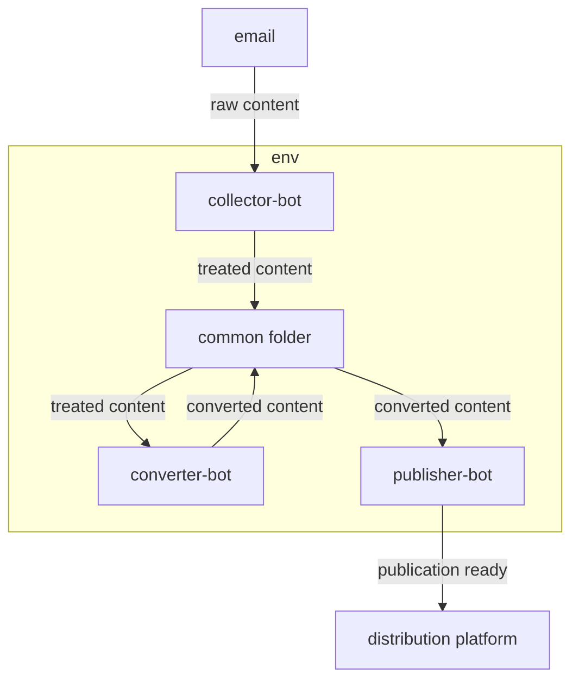

# newsletter-cast

Robots that automate the collection, conversion and distribution of newsletters.

## Workflow
  1. we received your newsletter
  2. collector-bot collects and processes your newsletter information and stores it in a common robots folder
  3. convert-bot converts the processed information (in the bots common folder) and converts it to audio (which is also stored in the bots common folder)
  4. publisher-bot captures the ready audio (in the robots common folder) and publishes it on the platforms available to it
  5. all ready !! your audio file is already distributed !
